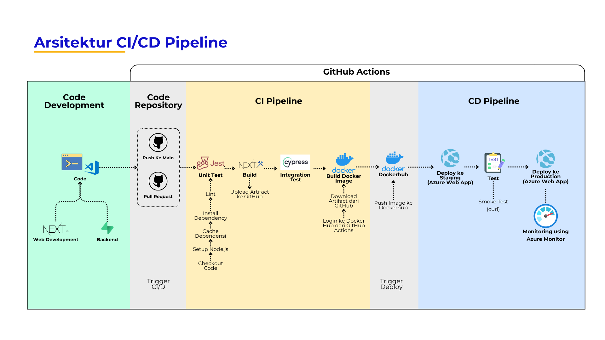

# Filminisme

[](https://github.com/daniprm/pso-b-17-movie-review-web/actions/workflows/ci-cd.yml)

Filminisme adalah sebuah website bagi pecinta film untuk mencari, mereview, dan mendiskusikan film.
Ini adalah dokumentasi teknismengenai arsitektur, teknologi, dan implementasi pipeline CI/CD dari website aplikasi Filminisme. Aplikasi ini memungkinkan pengguna untuk mencari, melihat detail, dan mengelola daftar tontonan (watchlist) film mereka, dibangun dengan mengutamakan praktik pengembangan modern, performa, dan kualitas kode.

## Arsitektur Aplikasi

Filminisme mengadopsi pendekatan pengembangan website berbasis komponen dengan pemisahan yang jelas antara logika frontend, layanan backend, dan alur kerja CI/CD.

-   **Frontend (Next.js)**: Aplikasi ini menggunakan Next.js 14 dengan App Router. Ini memungkinkan arsitektur berbasis komponen yang sangat modular dan optimal, dengan strategi rendering hibrida (Server atau Client Side Rendering) untuk performa maksimal.
-   **Backend (Supabase)**: Berfungsi sebagai Backend-as-a-Service (BaaS) yang menangani semua kebutuhan sisi server, termasuk otentikasi pengguna melalui Supabase Auth dan penyimpanan data pada database PostgreSQL.
-   **Styling (Tailwind CSS)**: Sebuah framework CSS utility-first yang memungkinkan pembuatan antarmuka kustom dengan cepat dan konsisten.
-   **Pengujian/Testing (Jest & Cypress)**: Kualitas kode dijamin melalui dua tahap pengujian, yakni, Jest untuk unit testing komponen individual dan Cypress untuk integration testing alur kerja pengguna secara end-to-end.

## Arsitektur Pipeline (CI/CD)

Proyek ini mengimplementasikan alur kerja Continuous Integration/Continuous Deployment (CI/CD) dengan menggunakan GitHub Actions. Pipeline ini mengotomatiskan seluruh proses, mulai dari pengujian/testing hingga deployment ke lingkungan produksi, memastikan setiap perubahan kode diuji secara menyeluruh sebelum sampai ke pengguna.



## Teknologi yang Digunakan

-   **Next.js**: Kerangka kerja React yang digunakan untuk membangun antarmuka pengguna Filminisme.
-   **Supabase**: Digunakan untuk mengatur basis data dan seluruh tugas backend seperti autentikasi.
-   **GitHub Actions**: Alat utama yang mengatur keseluruhan alur kerja CI/CD, mulai dari testing hingga deployment.
-   **Jest**: Digunakan untuk melakukan *unit testing* pada komponen dan fungsi individual dalam kode JavaScript/TypeScript.
-   **Cypress**: Digunakan untuk melakukan *integration testing*, memvalidasi alur kerja pengguna dari awal hingga akhir.
-   **Docker**: Digunakan untuk membuat *container image* dari aplikasi, memastikan konsistensi lingkungan dari lokal hingga produksi.
-   **Docker Hub**: Berfungsi sebagai *container registry* yang menyimpan Docker image yang siap di-deploy.
-   **Azure Web App**: Platform cloud dari Microsoft yang digunakan sebagai tujuan deployment untuk lingkungan Staging dan Produksi. Di dalam Azure Web App sudah tersedia fitur monitoring.

## Konfigurasi
**1. Setup Azurre Web App**

Aplikasi dideploy ke Azure Web App menggunakan GitHub Actions dengan source code dari repository GitHub `daniprm/PSO-B-17-MOVIE-REVIEW-WEB` pada branch `main`. Proses deployment memanfaatkan Docker image yang tersimpan di Docker Hub dengan nama daniprm/pso-b-17-filminisme. 


**2. Publish Profile untuk Deploy Azure ke Web App**

Publish profile digunakan sebagai kredensial untuk autentikasi dalam tahap deploy ke Azure Web App


**3. Setup Azure Web App untuk Staging**

Pada deployment slots dibuat dua slot, dengan satu sebagai production serta yang lainnya sebagai slot stagging.


**4. Docker Personal Access Tokens**

Docker Personal Access Token digunakan sebagai pengganti password autentikasi yang akan dimasukkan pada github action agar bisa mengakses docker hub dengan aman.


**5. Setup Repository Secrets untuk GitHub Actions**

Repository secrets di GitHub digunakan untuk menyimpan data sensitif seperti token akses, kredensial API, kata sandi, atau environemnt variables yang digunakan dalam pipeline CI/CD dengan aman.


### Tahapan Pipeline

Alur CI/CD ini terdiri dari beberapa tahapan (jobs) yang dijalankan secara berurutan. Alur ini akan terpicu setiap kali ada `push` atau `pull_request` ke branch `main`.

**1. Lint & Unit Tests**

Tahap awal ini bertanggung jawab untuk memastikan kualitas dan konsistensi kode melalui linting dan menjalankan unit test.
-   **Langkah-langkah**:
    -   *Checkout Kode*: Mengunduh kode sumber dari repositori dengan menggunakan `actions/checkout@v4`.
    -   *Setup Node.js*: Mengonfigurasi lingkungan Node.js versi 20.
    -   *Install Dependensi*: Mengambil semua dependensi dari file package-lock.json lalu menginstall dependensi dengan perintah  `npm ci`.
    -   *Jalankan Lint*: Menjalankan linter dengan `npm run lint`.
    -   *Jalankan Unit Tests*: Menjalankan unit test dengan `npm test` menggunakan Jest.

**2. Build Next.js App & Cypress Integration Test**

Setelah kode lolos dari pemeriksaan awal, aplikasi akan di-build dan kemudian dilakukan integration test menggunakan Cypress.
-   **Langkah-langkah**:
    -   *Checkout Kode*: Mengunduh kode sumber dari repositori dengan menggunakan `actions/checkout@v4`.
    -   *Setup Node.js*: Mengonfigurasi lingkungan Node.js versi 20.
    -   *Install Dependensi*: Mengambil semua dependensi dari file package-lock.json lalu menginstall dependensi dengan perintah  `npm ci`.
    -   *Build Aplikasi*: Melakukan build aplikasi Next.js dengan `npm run build`.
    -   *Jalankan Cypress Tests*: Menjalankan integration test secara otomatis (`cypress run`) untuk memvalidasi alur kerja aplikasi secara end-to-end. Untuk melakukan integration test, website akan secara otomatis dijalankan di localhost:3000 dan menerima environment variables seperti NEXT_PUBLIC_SUPABASE_URL, NEXT_PUBLIC_SUPABASE_ANON_KEY, CYPRESS_userEmail, CYPRESS_userPassword agar backend website bisa bekerja.
    -   *Upload Artefak Build*: Jika semua pengujian berhasil, hasil build diunggah sebagai artefak ke GitHub dengan nama `nextjs-build-output` untuk digunakan pada tahap selanjutnya dengan menggunakan `actions/upload-artifact@v4`. Hasil build yang disimpan yakni, folder .next yang berisi hasil build, file package.json dan package-lock.json yang berisi file dependensi, dan file next.config.mjs yang berisi konfigurasi Next.js.

**3. Build & Push Docker Image**

Setelah dilakukan testing, build, dan hasil build berhasil disimpan sebagai artifact di GitHub, berikutnya Docker image akan dibuat dari artefak build dan diunggah ke Docker Hub. Tahap ini hanya berjalan jika ada `push` ke branch `main`.
-   **Langkah-langkah**:
    -   *Checkout Kode*: Mengunduh kode sumber dari repositori dengan menggunakan `actions/checkout@v4`.
    -   *Download Artefak Build*: Mengunduh artefak bernama `nextjs-build-output` dengan menggunakan `actions/download-artifact@v4`.
    -   *Login ke Docker Hub*: Melakukan autentikasi ke Docker Hub dengan menggunakan kredensial Docker yang sudah disimpan di GitHub Secrets.
    -   *Build dan Push Docker Image*: Membuat Docker image berdasarkan perintah dari `Dockerfile` dan mengunggahnya ke Docker Hub dengan dua tag: `latest` dan berdasarkan `commit SHA`.

**4. Deploy & Smoke Test Staging**

Image yang berhasil dibuat kemudian di-deploy ke lingkungan staging untuk verifikasi akhir dengan dilakukan smoke test.
-   **Langkah-langkah**:
    -   *Deploy ke Azure Web App Staging*: Melakukan deployment Docker image ke slot staging di Azure Web App. Digunakan publish profile yang telah disimpan di GitHub Secrets untuk melakukan deploy ke Azure Web App Staging. Selain itu, pada tahap ini juga diambil images dari Dockerhub yang telah disimpan pada tahap sebelumnya. Pengambilan images secara langsung dilakukan oleh Azure, jadi, di Azure Web App sudah dikonfigurasi untuk terhubung dengan Dockerhub.
    -   *Smoke Test Staging*: Melakukan *smoke test* dengan mengirimkan permintaan `curl` ke URL staging untuk memastikan aplikasi berjalan dengan baik. Namun, pipeline akan menunggu selama 60 detik untuk menunggu Azure Web App selesai mengonfigurasi web yang telah dibuild dari Docker Image, setelah itu smoke test dilakukan. Hal ini penting untuk memastikan bahwa website benar-benar telah berhasil berjalan dan dapat diakses oleh pengguna akhir sehingga jika di staging ternyata tidak bisa diakses, maka proses CI/CD akan berhenti dan website di lingkungan produksi tidak rusak/error. 

**5. Deploy to Production**

Setelah seluruh tahap CI/CD sebelumnya berhasil, maka berikutnya aplikasi siap untuk di-deploy ke lingkungan produksi.
-   **Langkah-langkah**:
    -   *Deploy ke Azure Web App Production*:  Melakukan deployment Docker image ke lingkungan produksi utama di Azure Web App. Digunakan publish profile yang telah disimpan di GitHub Secrets untuk melakukan deploy ke Azure Web App. Selain itu, pada tahap ini juga diambil images dari Dockerhub yang telah disimpan pada tahap sebelumnya. Pengambilan images secara langsung dilakukan oleh Azure, jadi, di Azure Web App sudah dikonfigurasi untuk terhubung dengan Dockerhub.

## Panduan Instalasi Lokal

### Prasyarat
-   Node.js (v20.x atau lebih baru)
-   NPM
-   Akun Supabase

### Langkah-langkah
1.  **Clone Repositori**: `git clone https://github.com/daniprm/pso-b-17-movie-review-web.git`
2.  **Masuk ke Direktori**: `cd pso-b-17-movie-review-web`
3.  **Instal Dependensi**: `npm install`
4.  **Konfigurasi Environment**: Gunakan `.env.local` dan isi dengan kredensial Supabase Anda:
       ```env
        NEXT_PUBLIC_SUPABASE_URL=your-supabase-url
        NEXT_PUBLIC_SUPABASE_ANON_KEY=your-supabase-anon-key
       ```
6. **Buat Database**: Di Supabase, buat database dengan perintah SQL berikut:
   ```
    -- WARNING: This schema is for context only and is not meant to be run.
    -- Table order and constraints may not be valid for execution.
    
    CREATE TABLE public.actors (
      id bigint GENERATED ALWAYS AS IDENTITY NOT NULL,
      created_at timestamp with time zone NOT NULL DEFAULT now(),
      name text NOT NULL,
      CONSTRAINT actors_pkey PRIMARY KEY (id)
    );
    CREATE TABLE public.comments (
      id bigint GENERATED ALWAYS AS IDENTITY NOT NULL,
      created_at timestamp with time zone NOT NULL DEFAULT now(),
      movie_id bigint,
      comment text,
      user_id uuid DEFAULT gen_random_uuid(),
      email text NOT NULL,
      CONSTRAINT comments_pkey PRIMARY KEY (id),
      CONSTRAINT comments_user_id_fkey FOREIGN KEY (user_id) REFERENCES auth.users(id),
      CONSTRAINT comments_movie_id_fkey FOREIGN KEY (movie_id) REFERENCES public.movies(id)
    );
    CREATE TABLE public.genre (
      id bigint GENERATED ALWAYS AS IDENTITY NOT NULL,
      created_at timestamp with time zone NOT NULL DEFAULT now(),
      name text NOT NULL,
      CONSTRAINT genre_pkey PRIMARY KEY (id)
    );
    CREATE TABLE public.mov_actors (
      id bigint NOT NULL,
      created_at timestamp with time zone NOT NULL DEFAULT now(),
      actor_id bigint NOT NULL,
      CONSTRAINT mov_actors_actor_id_fkey1 FOREIGN KEY (actor_id) REFERENCES public.actors(id),
      CONSTRAINT mov_actors_id_fkey FOREIGN KEY (id) REFERENCES public.movies(actors_id),
      CONSTRAINT mov_actors_actor_id_fkey FOREIGN KEY (actor_id) REFERENCES public.actors(id)
    );
    CREATE TABLE public.mov_genres (
      id bigint NOT NULL,
      created_at timestamp with time zone NOT NULL DEFAULT now(),
      genre_id bigint NOT NULL,
      CONSTRAINT mov_genres_genre_id_fkey FOREIGN KEY (genre_id) REFERENCES public.genre(id),
      CONSTRAINT mov_genres_id_fkey FOREIGN KEY (id) REFERENCES public.movies(genres_id)
    );
    CREATE TABLE public.movies (
      id bigint GENERATED ALWAYS AS IDENTITY NOT NULL,
      created_at timestamp with time zone NOT NULL DEFAULT now(),
      title text,
      year integer,
      rating real,
      poster_url text,
      description text,
      director text,
      genres_id bigint GENERATED ALWAYS AS IDENTITY NOT NULL UNIQUE,
      actors_id bigint GENERATED ALWAYS AS IDENTITY NOT NULL UNIQUE,
      CONSTRAINT movies_pkey PRIMARY KEY (id)
    );
    CREATE TABLE public.watchlist (
      id bigint GENERATED ALWAYS AS IDENTITY NOT NULL,
      created_at timestamp with time zone NOT NULL DEFAULT now(),
      movie_id bigint,
      user_id uuid NOT NULL DEFAULT gen_random_uuid(),
      isWatched boolean NOT NULL DEFAULT false,
      CONSTRAINT watchlist_pkey PRIMARY KEY (id),
      CONSTRAINT watchlist_user_id_fkey FOREIGN KEY (user_id) REFERENCES auth.users(id),
      CONSTRAINT watchlist_movie_id_fkey FOREIGN KEY (movie_id) REFERENCES public.movies(id)
    );
   ```
    Berikut adalah skema database dari Filminisme:
   


    

### Menjalankan Aplikasi
-   **Mode Pengembangan**: `npm run dev`
-   **Menjalankan Tes Lokal**: `npm test` (untuk Jest) dan `npm run cypress:open` (untuk Cypress).
